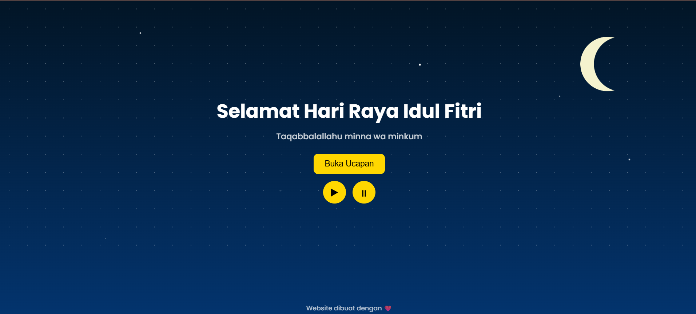
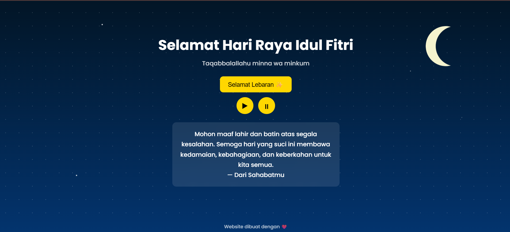

🌙 Eid Greeting Website

 Website ucapan <b>Selamat Hari Raya Idul Fitri</b> dengan dekorasi langit malam, animasi teks, dan musik latar untuk menciptakan suasana Lebaran yang hangat. 
 
    
 
  

📸 Preview

     

✨ Features

🌙 Dekorasi bulan sabit animasi

⭐ Background langit malam dengan bintang

💬 Animasi teks ucapan

🎵 Background music dengan tombol play / pause

📱 Responsive design (Desktop, Tablet, Mobile)

🛠 Tech Stack

Project ini dibuat menggunakan teknologi sederhana tanpa framework:

HTML5

CSS3

Vanilla JavaScript

📁 Project Structure

eid-greeting
│
├── assets
│
├── preview
│ ├── preview_1.png
│ └── preview_2.png
│
├── index.html
├── style.css
├── script.js
└── README.md

🎯 Purpose

Project ini dibuat sebagai latihan untuk mempelajari dasar Front-End Web Development, terutama:

Layouting dengan CSS

Animasi menggunakan CSS

Manipulasi DOM dengan JavaScript

Interaksi user (button dan audio)

Responsive web design

🚀 Live Demo

Website dapat diakses melalui:

https://username.github.io/eid-greeting

(Link akan aktif setelah project dipublish menggunakan GitHub Pages)

📌 Note

Ini adalah project website pertama saya, jadi mohon dimaklumi jika masih terdapat kekurangan.

Project ini dibuat sebagai bagian dari proses belajar untuk meningkatkan kemampuan saya dalam Front-End Web Development.

📜 License

Project ini bebas digunakan untuk keperluan belajar dan personal project.
